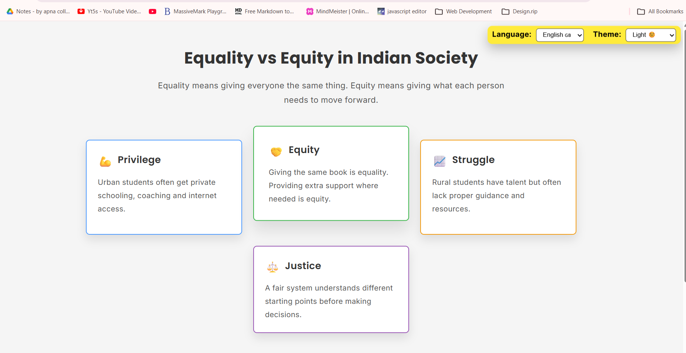
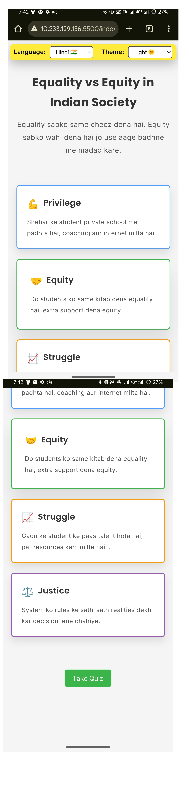

# Equality vs Equity Project

A simple educational web project to explain the difference between Equality and Equity with interactive UI and quiz.

## Preview

### Desktop View

### Mobile View

## Features
- Light / Dark / System theme
- Hindi & English language toggle
- Responsive design
- Keyboard accessible
- Interactive quiz

## Technologies Used
- HTML
- CSS
- JavaScript

## 🌐 Live Preview
[![Live Demo]](https://golu-dhama.github.io/equality-vs-equity/)

## How to Use
Open index.html in browser

## Author
Golu

